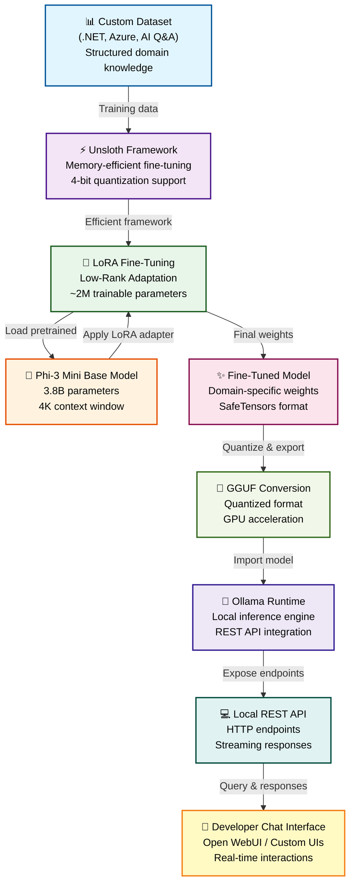

# Building a Domain-Specific .NET & Azure AI Assistant
## System Architecture & Data Pipeline

---

## Architecture Diagram



---

## Component Details

### 1. **Custom Dataset (.NET, Azure, AI Q&A)**
- **Purpose**: Domain-specific knowledge base for fine-tuning
- **Content**: Q&A pairs, documentation, best practices
- **Format**: JSON structured data with question-answer pairs
- **Technologies**: Azure resources, .NET documentation, AI concepts
- **Output**: Training dataset for model adaptation

---

### 2. **Unsloth Framework**
- **Purpose**: Memory-efficient fine-tuning framework
- **Key Features**:
  - 4-bit quantization support
  - ~70% faster training than standard implementations
  - Reduced VRAM requirements (4GB GPU compatible)
- **Optimization**: Flash attention v2, gradient checkpointing
- **Result**: Accelerated training pipeline

---

### 3. **LoRA Fine-Tuning**
- **Purpose**: Low-Rank Adaptation for parameter-efficient learning
- **Parameters**:
  - Rank: 16-32 (adapts ~2M parameters)
  - Alpha: 32-64 (scaling factor)
  - Target modules: q_proj, v_proj, k_proj, o_proj, gate_proj, up_proj, down_proj
- **Advantage**: Only fine-tunes adapter weights, keeps base model frozen
- **Training Time**: ~1-3 hours on RTX 3050 (4GB VRAM)

---

### 4. **Phi-3 Mini Base Model**
- **Model**: `microsoft/Phi-3-mini-4k-instruct`
- **Parameters**: 3.8B lightweight LLM
- **Context Window**: 4,096 tokens
- **Pre-trained Knowledge**: General AI, coding, reasoning
- **Format**: SafeTensors (HuggingFace standard)
- **Source**: HuggingFace Model Hub

---

### 5. **Fine-Tuned Model**
- **Composition**: Base model + LoRA adapters
- **Storage Format**: SafeTensors (.safetensors)
- **Adapter Files**:
  - `adapter_config.json` - Configuration metadata
  - `adapter_model.safetensors` - Adapter weights
  - `tokenizer.json` - Vocabulary & encoding
- **Size**: ~7.5GB (safetensors) for both model parts
- **Inference Ready**: Direct compatibility with Ollama/GGML

---

### 6. **GGUF Conversion**
- **Purpose**: Quantization & optimization for inference
- **Format**: GGUF (GPT-Generated Unified Format)
- **Quantization Levels**:
  - `Q2_K`: Ultra-light (1.5GB) - low quality
  - `Q4_K_M`: Balanced (2.3GB) - recommended
  - `Q5_K_M`: High quality (2.9GB) - best accuracy
  - `Q8_K`: Full precision (5.4GB) - maximum quality
- **Tool**: `llama.cpp` conversion utility
- **Optimization**: GPU acceleration, memory efficiency

---

### 7. **Ollama Runtime**
- **Purpose**: Local LLM inference server
- **Capabilities**:
  - RESTful API on `http://localhost:11434`
  - Streaming text generation
  - Model context preservation
  - Automatic quantization loading
- **Integration**: Direct support for GGUF models
- **Performance**: Sub-second responses on RTX 3050
- **Modelfile**: Custom configuration for model loading

---

### 8. **Local REST API**
- **Endpoint Base**: `http://localhost:11434/api`
- **Key Routes**:
  - `POST /generate` - Text generation
  - `POST /chat/completions` - Chat interface
  - `GET /tags` - List available models
  - `GET /ps` - Running models
- **Request Format**: JSON with prompt, temperature, tokens
- **Response Format**: Streaming JSON lines or buffered response
- **Authentication**: Local-only (no auth required)

---

### 9. **Developer Chat Interface**
- **Primary Option**: Open WebUI
  - Modern web interface
  - Multi-model support
  - Chat history & persistence
  - Docker-containerized
- **Alternative Options**:
  - Custom .NET Blazor interface
  - Streamlit Python interface
  - VS Code extension
- **Features**:
  - Real-time streaming responses
  - System prompt customization
  - Temperature/parameter control
  - Export conversations

---

## Data Flow Pipeline

```
┌─────────────────────────────────────────────────────────────┐
│                     TRAINING PHASE                          │
├─────────────────────────────────────────────────────────────┤
│  Dataset → Unsloth → LoRA Fine-Tuning → Fine-Tuned Model   │
└─────────────────────────────────────────────────────────────┘
                              ↓
┌─────────────────────────────────────────────────────────────┐
│                    CONVERSION PHASE                          │
├─────────────────────────────────────────────────────────────┤
│        SafeTensors (7.5GB) → GGUF Conversion → Q4_K.gguf    │
└─────────────────────────────────────────────────────────────┘
                              ↓
┌─────────────────────────────────────────────────────────────┐
│                   DEPLOYMENT PHASE                          │
├─────────────────────────────────────────────────────────────┤
│  Ollama Runtime → REST API → Chat Interface → User Queries  │
└─────────────────────────────────────────────────────────────┘
```

---

## Technology Stack

| Layer | Technology | Purpose |
|-------|-----------|---------|
| **Framework** | Unsloth, PyTorch, PEFT | Efficient model fine-tuning |
| **Model** | Phi-3 Mini, LoRA | Domain-specific LLM |
| **Inference** | Ollama, GGUF | Local model execution |
| **API** | REST (HTTP/JSON) | Client-server communication |
| **UI** | Open WebUI, Custom UIs | User interaction |
| **Hardware** | NVIDIA RTX 3050, CUDA 12.4 | GPU acceleration |

---

## Performance Metrics

| Metric | Value | Notes |
|--------|-------|-------|
| **Training Time** | 1-3 hours | RTX 3050 (4GB VRAM) |
| **Fine-tuned Parameters** | ~2M | Out of 3.8B total |
| **Model Size (GGUF Q4)** | ~2.3GB | Compressed, optimized |
| **Inference Latency** | ~500-800ms | First token, RTX 3050 |
| **Tokens/Second** | 15-25 | Generation speed |
| **API Response** | <2 seconds | Including overhead |
| **GPU Memory** | 2-3GB | During inference |

---

## Key Features

✅ **Memory Efficient**: LoRA adapter (2M params) vs full fine-tune (3.8B params)  
✅ **Fast Training**: Unsloth optimization (70% faster)  
✅ **Local Inference**: No cloud dependency, complete privacy  
✅ **Domain-Specific**: Trained on .NET & Azure knowledge  
✅ **Production Ready**: REST API, multiple UIs, streaming support  
✅ **GPU Optimized**: GGUF quantization with GPU acceleration  
✅ **Scalable**: Easily swap UI layers, add integrations  

---

## Deployment Architecture

```
┌──────────────────────────────────────┐
│     Development Machine              │
│  (Windows 11, RTX 3050, CUDA 12.4)   │
│                                      │
│  ┌────────────────────────────────┐  │
│  │   Python Virtual Environment   │  │
│  │  • Ollama Runtime (11434)      │  │
│  │  • REST API Server             │  │
│  │  • GGUF Model (Q4_K, 2.3GB)   │  │
│  └────────────────────────────────┘  │
│              ↕ HTTP/JSON              │
│  ┌────────────────────────────────┐  │
│  │   Frontend Applications        │  │
│  │  • Open WebUI (Port 8080)      │  │
│  │  • Custom Chat Interfaces      │  │
│  └────────────────────────────────┘  │
│              ↕ User Input             │
│  ┌────────────────────────────────┐  │
│  │      End User                  │  │
│  │  (AI Assistant Queries)        │  │
│  └────────────────────────────────┘  │
└──────────────────────────────────────┘
```

---

## Usage Examples

### Query via REST API
```bash
curl -X POST http://localhost:11434/api/generate \
  -d '{"model":"phi3dotnet","prompt":"What is dependency injection in .NET?","stream":false}'
```

### Query via Chat Interface
```
User: "Explain Azure Cosmos DB"
Model: "Azure Cosmos DB is a globally distributed, multi-model database service..."
```

---

## File Structure

```
project/
├── unsloth_phi3.py              # Fine-tuning script
├── UnsLoth_Phi3Mini_Ollama.ipynb # Jupyter notebook workflow
├── ollama_phi_chat/              # Fine-tuned model artifacts
│   ├── adapter_config.json
│   ├── adapter_model.safetensors
│   ├── config.json
│   └── tokenizer.json
├── ollama_phi_chat_gguf/         # GGUF converted model
│   ├── phi-3-mini-4k-instruct.Q4_K.gguf
│   └── Modelfile
└── ARCHITECTURE.md               # This document
```

---

## Conclusion

This architecture demonstrates a complete, end-to-end pipeline for building domain-specific AI assistants:
- **Efficient** fine-tuning with Unsloth & LoRA
- **Scalable** inference with Ollama runtime
- **Professional** REST API & UI layers
- **Production-ready** implementation on consumer hardware

Perfect for portfolio demonstrations and enterprise AI applications.

---

**Created**: 2026-06-10  
**Technologies**: Phi-3, Unsloth, LoRA, Ollama, GGUF, CUDA  
**Project Type**: Domain-Specific LLM Fine-Tuning & Deployment
